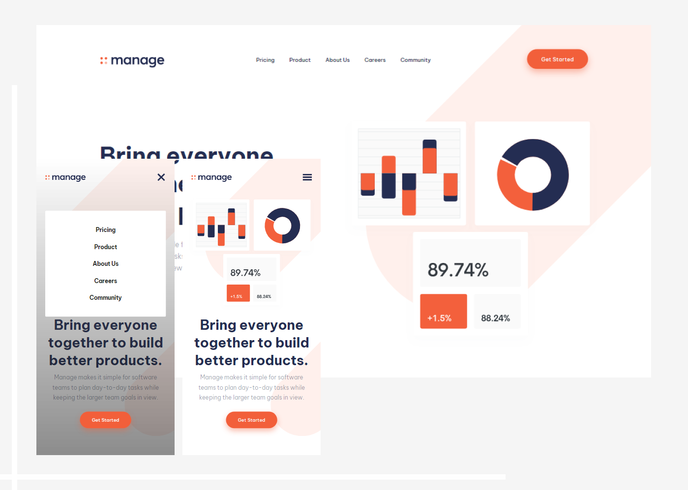

# Frontend Mentor - Manage landing page solution

This is a solution to the [Manage landing page challenge on Frontend Mentor](https://www.frontendmentor.io/challenges/manage-landing-page-SLXqC6P5). Frontend Mentor challenges help you improve your coding skills by building realistic projects.

## Table of contents

1. The Challenge
1. Screenshot of My Work
1. My Process
1. Author
1. Acknowledgements

## Overview

### The challenge

Users should be able to:

- View the optimal layout for the site depending on their device's screen size
- See hover states for all interactive elements on the page
- See all testimonials in a horizontal slider
- Receive an error message when the newsletter sign up `form` is submitted if:
  - The `input` field is empty
  - The email address is not formatted correctly

### Screenshot

### Links

- Solution URL: [Go to frontendmentor.io](https://www.frontendmentor.io/solutions/responsive-landing-page-using-css-grid-OwcriuDAO)
- Live Site URL: [View live site](https://rouwe.github.io/fem_manage_landing_page/)

## My process

I started by diving the page into smaller sections and tackling each one at a time. Starting at the top to bottom while adding some functionality using vanilla JavaScript when an interaction is required. I also used a combination of CSS Grid and Flexbox for laying out things. I've used a lot of pseudo elements for backgrounds instead of empty divs.

### Built with

- Semantic HTML5 markup
- CSS custom properties
- Flexbox
- CSS Grid
- Mobile-first workflow
- JS

### What I learned

I learned a lot from this project. I've come to understand a little bit about the used of pseudo-elements. Also, I found out that using empty divs is considered a bad practice, specially for accessibility.

### Continued development

I will be focusing more on fundamentals of creating a website.

## Author

- Frontend Mentor - [Rouwe](https://www.frontendmentor.io/profile/rouwe)

## Acknowledgments

I'm thankful for Frontend Mentor's challenges. Since this will allow me to hone my skills further.
